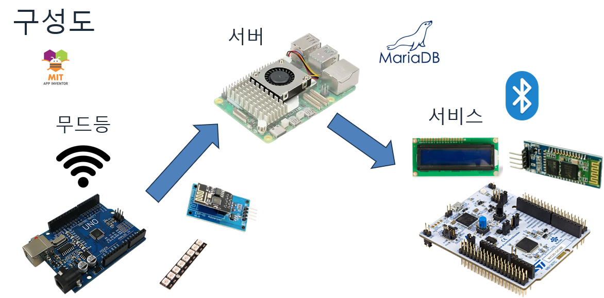
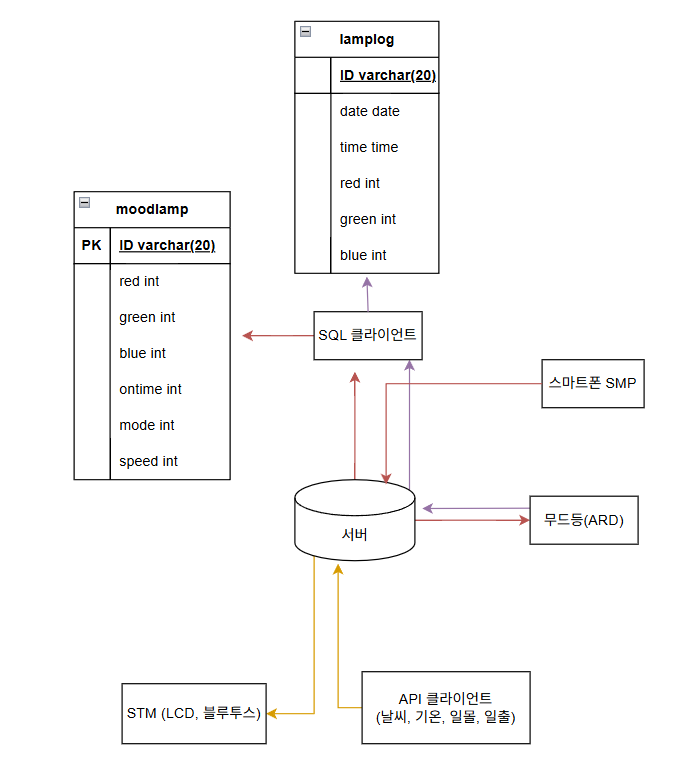

# 스마트 무드등 (Smart Mood Lamp)

IoT 기반 네트워크 통신을 활용하여 원격으로 제어 가능한 스마트 무드등 시스템입니다. 현재 시간, 날씨, 일출·일몰 정보를 제공하며, 서버·DB·임베디드·클라이언트를 통합한 미니 프로젝트입니다.

---

## 🎯 수행 목표

* IoT 네트워크 기반의 원격 무드등 제어 시스템 구현
* 시간·날씨·일출·일몰 정보를 활용한 정보 제공형 조명 서비스 개발
* Arduino, 서버, DB, UI를 연동한 통합 시스템 경험 확보

---

## 🛠 사용 기술

* **언어 / 펌웨어**: C, Arduino,STM32
* **통신**: TCP/IP, Bluetooth
* **서버 / API**: REST API (날씨, 시간, 일출·일몰)
* **데이터베이스**: SQL (Insert / Update / Get)

---

## 🧩 시스템 구성

---
## 🔄 동작 흐름

1. 클라이언트가 서버에 주기적으로 데이터 요청
2. 서버는 외부 API를 통해 시간·날씨·일출·일몰 정보 수신
3. 수신 데이터는 DB에 저장 및 갱신
4. Arduino 무드등은 명령을 수신하여 LED 및 LCD 상태 변경

---

## ⚙️ 주요 기능

### 1. Arduino (무드등 LED)

- **무드등 LED 제어 전용 디바이스**
- 서버로부터 전달받은 명령에 따라 LED 색상, 밝기, 모드 제어
- **조명 제어 모드**
  - `isOn = 0` : OFF 상태
  - `isOn = 1` : 지정 색상 ON
  - `isOn = 2` : 색상 순환 모드

---

### 2. STM32 (LCD 디스플레이)

- **정보 출력 전용 디바이스**
- 서버로부터 시간·날씨·일출·일몰 정보를 수신
- LCD에 수신된 정보를 표시
  - `GET TIME` : 현재 시간
  - `GET WEATHER` : 현재 날씨
  - `GET SUN` : 일출·일몰 시간

---

### 2. 서버 및 DB

- 클라이언트 요청에 따라 DB에 상태 값 Insert / Update
- GET 요청을 통해 저장된 무드등 상태 정보 제공
- ON / OFF 명령 시 DB 상태 동기화 후 Arduino로 전송

---

### 3. SMP 클라이언트 (UI)

- 최초 연결 시 DB로부터 기존 설정 값 수신 후 UI 초기화
- 슬라이더 조작 후 Focus Out 시 무드등에 즉시 값 전송
- Set 버튼 클릭 시 UI 데이터를 DB에 저장
- DB 처리 완료 시 무드등에 동일 데이터 전송

---
##  🎬 동작 영상 (Demo)
본 프로젝트의 실제 동작 모습은 아래 영상을 통해 확인할 수 있습니다.

https://github.com/user-attachments/assets/97890ce3-3bbe-4afa-a134-a8fdb99ed125

https://github.com/user-attachments/assets/19d2a473-c6f1-4032-9ad3-f6b58edc61b0

---

## 🌱 개선 사항

- 조도 센서 및 인체 감지 센서 연동을 통한 자동 밝기 조절
- 알람 기능 및 수면 모드 등 사용자 맞춤 기능 추가

---

## ✅ 결과 및 배운 점

- 간단한 하드웨어 제어를 통한 임베디드 시스템과 서버·DB·UI를 통합한 IoT 서비스 구현 경험

---

